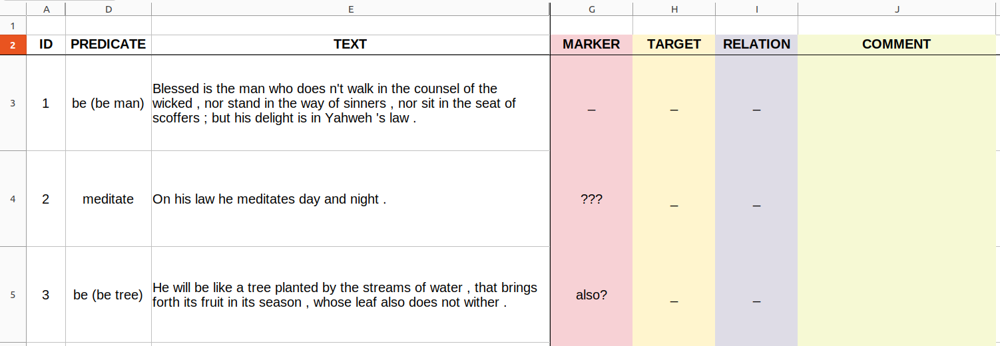

AURIS Discourse Extension, Christian Chiarcos, University of Augsburg, Germany, draft version of 2023-12-15

# 1. Discourse Relations

The annotation of discourse relations adopts a different format and is thus described in an appendix to the AURIS guidelines.

**Discourse relations** or **coherence relations** represent relations that describe the semantic or pragmatic relation utterances in a discourse. They are an important device in the establishment of coherence in text comprehension, and are thus often (but not always) signalled by means of language specific cues, or discourse markers, e.g., conjunctions, adverbials and particles such as _and_, _or_, _but_ or _then_. A speaker can use discourse markers to explicate a discourse relation to the addressee, or to assert a discourse relation that would contradict the addressee's intuitions:

- _Peter pushed Jim. He stumbled._ (CAUSAL?)
- _Peter pushed Jim, because he(=Peter) stumbled._ (CAUSAL: reason)
- _Peter pushed Jim. As a result, he(=Jim) stumbled._ (CAUSAL: result)
- _Peter pushed Jim. Then, he(=Peter) stumbled._ (TEMPORAL, not CAUSAL)

Often, it is assumed that discourse relations closely interact with the hierarchical organization of discourse, by establishing larger discourse segments (discourse units) that span multiple sentences which are then further connected by means of discourse relations with other discourse segments to constitute a coherent text. So far, AURIS remains agnostic about the _hierarchical_ organization of discourse. Instead, we follow the approach of the Penn Discourse Treebank (PDTB, Prasad et al. 2007) and provide _shallow_ discourse annotations only. Our guidelines are based on a synthesis of PDTB and ISO 24617-8 guidelines, so that existing PDTB-style annotations (as available for many languages), resp., discourse annotations in general (which have a ISO 24617-8 interpretation), can be mapped to AURIS.

We annotate discourse relations between sentences and thus annotate entire sentences, only. For this reason, manual discourse annotation is conducted on a different format, but using the same set of technologies (i.e., Spreadsheet Software).

Although complete sentences are the unit of annotation, the sentence may include material not relevant for the discourse relation at hand. Instead, annotators should focus on the main clause of the sentence.
There is an exception for attribution verbs, for which the main clause of the attributed statement (i.e., the reported speech) is to be annotated.

> Note that these guidelines are partially based on the Penn Discourse Treebank, which also accounts for intrasentential discourse relations. We thus still include examples of intrasentential relations in the definition of discourse relations. In the future, these are to be replaced by real-world intersentential corpus examples. 

The Goal of the annotation is to annotate every sentence with one **discourse relation**. It is neither required nor expected that the annotation of discourse relations leads to a tree structure. The refer to the sentence that is annotated as the **utterance**, the sentence that it is linked to by the discourse relation as the **(contextual) anchor**. If a discourse relation is indicated by an explicit discourse marker, this is syntactically integrated with the utterance. Accordingly, the applicability of a discourse relation can be tested by means of a paraphrase or substitution test where a diagnostic discourse marker is inserted: If the insertion of a diagnostic discourse marker does not change the meaning of the utterance in its context, the corresponding discourse relation can be annotated. A list of diagnostic markers is provided in an appendix.

The order of anchor and utterance is flexible, but in many cases, the anchor precedes the utterance. For implicit discourse markers, the anchor should generally precede the utterance, explicit discourse can be used by the speaker to underline that the anchor follows the utterance. A notable special case is the first part of a paired discourse marker, such as *On the one hand ... . On the other hand ...*. Here, the first utterance, marked with *on the one hand*, takes the second as its anchor, whereas the second takes the first as its anchor. If an utterance carries more than one explicit discourse marker, we annotate the first discourse marker, only.

> **Note**: This section is concerned with the annotation of discourse relations, i.e., semantic or functional relations between utterances. As for relations between discourse referents (coreference, Centering Transitions), this is subject to Sect. 5 of the AURIS guidelines.

## 1.1 Preparation and Format

Annotation is done using Spreadsheet software such as MS Excel, LibreOffice or Google Spreadsheets. We provide files for annotation in MS Excel (`*.xslx`) format. These contain the original text along with automated pre-annotations, formulas to dynamically populate the spreadsheet depending on other annotations and special formatting for elements to be annotated.

If you open an XSLX file to be annotated, it can contain more than one worksheet. Select the worksheet named `sentence-level annotation`. If successful, your table should have a structure as illustrated in Fig. 1:

Fig. 1: Sample file

Empty cells should be filled with `_`, automated pre-annotations are marked with question marks. After annotations, no question marks should remain.

The spreadsheet file contains the following columns:

- `ID` (col A) sentence number
- `PREDICATE` (col D) main verb, automatically annotated
- `TEXT` (col E) utterance to be annotated
- `MARKER` (col G) possible discourse marker. Automatically identified discourse markers are marked by a question mark. To be replaced with actual discourse marker (without question mark).
- `TARGET` (col H) ID of the utterance that serves as anchor of the discourse relation.
- `RELATION` (col I) discourse relation
- `COMMENT` (col J) free-text comment

Note that in the template, several columns are hidden. These are auxiliary columns that annotators don't need to look into.

Also note that automated pre-annotations might be incorrect. Except for `MARKER` (whose annotations should be replaced anyway), correcting an incorrect pre-annotation requires to leave a comment, either in an accompanying text file (annotation log), with reference to the corresponding sentence ID, or in the `COMMENT` column.

> **Note on protected mode**: In protected mode, columns and rows cannot be resized. If this is necessary, annotators are free to turn off protection. Please do not re-enable protection afterwards so that we can spot those files.

## 1.2 Annotation Tasks and Procedure

Annotation involves the following sub-tasks. Some of these tasks are automated, however, automated annotations, if found to be incorrect, should be corrected. In those cases, leave a comment in the `COMMENT` column.

1. For every sentence, identify the main predicate
	- Pre-annotation in `PREDICATE`. If the annotator believes the predicate to be incorrect, fix that column and leave a comment with an explanation.
2. For every sentence, identify the primary discourse marker (pre-annotation in `MARKER`)
	- Pre-annotation in `MARKER`. Should be manually confirmed or revised.
3. if there is an explicit discourse marker:
	1. annotate the anchor of the discourse relation (i.e., the sentence it refers to) in column `TARGET`, identified by its numerical ID. If there are multiple candidate anchors, annotate the closest anchor.
	2. annotate the discourse relation in `RELATION`
4. if there is no explicit discourse marker:
	1. the preceding target candidate is the (main predicate of the) preceding sentence.
	2. check whether the preceding target candidate is the target of a discourse relation with the (main predicate of the) preceding clause by asking yourself the following questions:
		1. is there a logical connection between these utterances that could be described in terms of a discourse relation?
		2. Is there an discourse marker *at the current utterance* that could be used to make this explicit? Annotate this discourse marker in `MARKER`, put it in round brackets to mark it as an implicit discourse marker.
		3. If a discourse relation (and, optionally, an implicit `MARKER`) has been confirmed, annotate the `TARGET` and the `RELATION`; continue in 5.
		4. If no discourse relation could be annotated, check the following utterance as candidate anchor, then extend further into preceding context until an anchor has been found or it can be assumed that no anchor exists. If the latter, explain why you think so in `COMMENT`.
5. use the `COMMENT` column to provide additional comments, e.g., if no target and/or discourse relation could be established.
6. continue with the next sentence.

> **Note**: For 4.2.1 and 4.2.2, it seems most practical to answer these questions in tandem, i.e., to check first which discourse marker could be applied without having the text sounding unnatural and then identify the corresponding discourse relation on that basis. Inserting (or paraphrasing with) diagnosting discourse markers is an established technique for testing the applicability of a discourse relation. See Sect. A.4.2 for more detailed instructions.

## 1.3 Identifying the Main Predicate

For every sentence, we annotate the discourse relations of its core statement. Syntactically, the core statement is represented by the main predicate and its syntactic dependents. The main predicate is identified by the following rules:

1. By default, the main predicate is the syntactic head of the first main clause in the current sentence
2. If the syntactic head is a nominal, adjectival or adverbial predicate of a copula clause with an explicit verb, the predicate consists of the copula in conjunction with the predicate.
3. If the syntactic head is an attribution verb (*say*, *write*, *think*, etc.) and the current sentence contains a reported statement (direct or indirect speech), the main predicate of the sentence is the main predicate of the reported statement.

> **Note 1**: For syntactic analysis, we expect pre-annotation in accordance with Universal Dependencies 2.x. See [there](https://universaldependencies.org/u/overview/syntax.html) for the definition of syntactic heads.

Rule 3 is designed to rule out verbs of attribution as main predicates. Here, we follow ISO 24617-8 in excluding them from discourse annotation (if the sentence contains a reported statement). In (1), the discourse relation doesn't hold between the communication acts (*Mr. Edelman said X. Mr. Ackerman contended Y.*) but between their respective statements (*X, [implicit:Concession] Y*). The respective main predicates are marked:

- (1) _[Mr. Edelman said]ATTRIBUTION the decision ”[**has nothing to do**]PRED with Marty Ackerman.” [Mr. Ackerman contended]ATTRIBUTION that it [**was a direct response**]PRED to his efforts to gain control of Datapoint._ (PDTB3, wsj 0333)

## 1.4 Annotating Discourse Markers

Discourse markers are cues that overtly mark discourse relations. For English, this primarily includes

- adverbials (ADVP and PP, e.g., *however*, *otherwise*, *then*, *as a result*, *for example*),
- coordinating conjunctions (e.g., *and*, *or*, *nor*), and
- subordinating conjunctions (e.g., *because*, *when*, *since*, *although*).

We distinguish three kinds of discourse markers: 

- Explicit discourse markers are stated in the text. Annotators should write them as plain strings.
- Alternative lexicalizations are phrasal expressions that convey the same meaning as a discourse marker and that could be paraphrased by a discourse marker. They are, however, not grammaticalized as discourse markers. Annotators should write these phrases as plain strings, and add a discourse marker that could be used as paraphrase after that in square brackets.
- Implicit discourse markers are not stated in the text. Annotators should write them in round brackets.

### 1.4.1 Annotating Explicit Discourse Markers

Explicit discourse markers are drawn from the following grammatical classes (Prasad et al. 2007):

- adverbials (ADVP and PP):

	- (2) *The magazine Success, **however**, was for years lackluster and unfocused.* (PDTB2, 1903)
	- (3) ***As a result**, industry operated out of small, expensive, highly inefficient industrial units.* (PDTB2, 0629)

	- DO NOT ANNOTATE adverbials modifying clauses other than the main predicate. In line with Universal Dependency syntax, the clause connected with the conjunction _and_ in (4) is syntactically analyzed as a dependent of the first clause. It does thus not carry the main predicate and neither _and_ nor _as a result_ should be annotated.

		- (4) *Polyvinyl chloride capacity “has overtaken demand **and** we are experiencing reduced profit margins **as a result**”, ...* (PDTB2, 2083)

- coordinating conjunctions, but only if attached to the main predicate of an utterance:
	
	- (5) *Only 19% of the purchasing managers reported better export orders in October, down from 27% in September. **And** 8% said export orders were down last month, compared with 6% the month before.* (PDTB2, 0036)

	- DO NOT ANNOTATE conjunctions not modifying the main predicate:

		- (6) *The House has voted to raise the ceiling to $3.1 trillion, **but** the Senate isn’t expected to act until next week at the earliest.* (PDTB2, 0008)
		- (7) *More common chrysotile fibers are curly **and** are more easily rejected by the body, Dr. Mossman explained.* (PDTB2, 0003)

- subordinating conjunctions, but only if attached to the main predicate of an utterance:
		
	- (8) *Why do local real-estate markets overreact to regional economic cycles? **Because** real-estate purchases and leases are such major long-term commitments that most companies and individuals make these decisions only when confident of future economic stability and growth.* (PDTB2, 2444)

	- DO NOT ANNOTATE conjunctions not modifying the main predicate:

		- (9) ***Since** McDonald’s menu prices rose this year, the actual decline may have been more.* (PDTB2, 1280, conjunction of a pre-posed dependent clause)

		- (10) *The federal government suspended sales of U.S. savings bonds **because** Congress hasn’t lifted the ceiling on government debt.* (PDTB2, 0008, conjunction of a post-posed dependent clause)

If the main predicate carries more than one discourse marker, annotate the first discourse marker, only:

- (11) *Small businesses say a recent trend is like a dream come true: more-affordable rates for employee-health insurance, initially at least. **But** then they wake up to a nightmare.* (PDTB3, wsj 0518; Webber et al. 2019b)

Here the, _but_ and _then_ encode independent discourse relations, the first indicating Concession, the second a temporal relation. However, _but then_ can also be analyzed as a single discourse marker, indicating Concession:

- (12) *To many, it was a ceremony more befitting a king than a rural judge seated in the isolated foothills of the southern Allegheny Mountains. **But then** Judge O’Kicki often behaved like a man who would be king – and, some say, an arrogant and abusive one.* (PDTB3, wsj 0267; Webber et al. 2019b)

Note that the first discourse marker may also occur at medial (or final) positions within a clause:

- (13) *The Ministry of Finance, **as a result**, has proposed a series of measures that would restrict business investment in real estate ...* (PDTB2, 0761, medial discourse marker)

Adverbials should be annotated as discourse markers only if they establish a relation between utterance and anchor. Interjections such as _well_, focus markers such as _anyway_, and clausal adverbials such as _strangely_, _probably_, _frankly_, _in all likelihood_ etc. are not annotated as discourse markers.
	
> Note that not all words and phrases that *can* serve as discourse markers actually do so under all circumstances: Some tokens can also serve other functions, e.g., _for_ can be a causal discourse marker (and then, be substituted with _because_), but it can also serve as a preposition indicating the beneficiary of an action. Likewise, discourse markers that serve to connect parts of the same utterance are beyond the scope of AURIS. Such expressions are not annotated as discourse connectives.

In the current workflow, the first candidate discourse marker is automatically annotated. However, note that this has been heuristically extracted and may include discourse markers not modifying the main predicate, or expressions that *could* serve as discourse markers but that don't in this particular context. Thus, in the column `MARKER`, these are always shown with a question mark and to be confirmed (or replaced) by manual annotation. Discourse markers with question marks are considered an error.

### 1.4.2 Annotation of implicit discourse markers

If an utterance does not feature an explicit discourse marker, annotators should try to test whether an explicit discourse marker could be inserted or whether another discourse relations applies. Example (14) shows an example of an implicit *because* inserted to connect two adjacent utterances

- (14) *Some have raised their cash positions to record levels. **[Implicit = because]** High cash positions help buffer a fund when the market falls.* (PDTB2, 0983)

In discourse relations with implicit discourse markers, the anchor always precedes the utterance. In the following, it would be logically possible to annotate Reason to point from the first utterance to the second, but because of ordering preferences for implicit relations, we only annotate the inverse relation Result:

- (15) Carl is crazy. **[Implicit = this is why]** he beats his wife. (Prasad and Bunt 2015, punctuation adjusted)

For annotating implicit discourse markers, annotators should use the list of discourse relations and their diagnostic discourse markers, and check it the order specified in Sect. **BELOW**.

1. check whether the preceding sentence could be an anchor
	1. by inserting the first discourse marker on the list, if that fails
	2. by inserting the second discourse marker, etc.
	3. if both utterances are connected by a coherence relation between two referring expressions, insert no marker, but annotate EntRel
2. if no discourse marker could be inserted, test the preceding utterance
	1. using the same procedure
3. iterate until an anchor and an implicit discourse marker have been found or no possible anchor can be expected anymore (e.g., because the text deals with different topics)

> Note: Unlike PDTB2, the annotation of implicit relations is not limited to adjacent utterances.

### 1.4.3 Alternative Lexicalizations

Many researchers distinguish discourse markers and alternative lexicalizations, i.e., a phrasal expression that conveys the meaning of a discourse marker that could be used in its place in a more or less equivalent way (e.g., *This observation leads us to conclude that ...* in place of *Thus, ...*). If such phrases are no longer than 5 words, annotators should annotate such phrases as explicit discourse markers. If such phrases are longer than 5 words, proceed as follows:

- provide a common discourse marker that could be used in place of the alternative lexicalization, write the alternative lexicalization and put the discourse marker in **square brackets** afterwards.

If the discourse marker you provided could also be used *in addition to* the alternative lexicalization, then treat this as implicit discourse marker, i.e.,

- provide the discourse marker you inferred in round brackets. 

## 1.5 Relation Inventory

AURIS discourse relations are organized in a hierarchy that is also used to define selection preferences for annotation.

### 1.5.1 Top-Level Organization

- **ADVERSATIVITY**: discourse relations concerned with highlighting prominent differences between the situations presented in utterance and anchor.
- **CONTINGENCY**: discourse relations in which one of the situations described in utterance and anchor causally influences the other, i.e., it provides a reason, explanation or justification in the other situation.
- **TEMPORAL**: the situations described in utterance and anchor are related temporally.
- **EXPANSION**: other relations which expand the discourse and move its narrative or exposition forward.
- **DIALOG**: discourse relations for turn-taking in dialog.
- **EntRel**: utterance and anchor are not related by any of the other types of discourse relations, but indirectly by addressing the same entities 

In addition to these, we use **NoRel** to mark utterances for which no anchor can be established.

### 1.5.2 Annotation Principles

- if the main predicate carries more than one explicit discourse marker, annotate the first explicit discourse marker
- if there is no discourse marker or the discourse marker is ambiguous with respect to the discourse relation it encodes:

	- annotate the most specific discourse relation possible, using the following preference hierachy

		- ADVERSATIVITY > CONTINGENCY > TEMPORAL > EXPANSION > DIALOG > EntRel > NoRel

The logic behind this ranking is that it describes a spectrum from semantically highly constrained (i.e., very specific) to semantically less constrained (i.e., more generic) relation types, and that annotators should annotate the most specific discourse relation applicable.

- adversative relations can involve a causal element (especially CONCESSION), so that these are considered more specific than causal
- causal (CONTINGENCY) relations imply a temporal element (cause precedes or overlaps with result), so that these are more specific than temporal
- as a means of driving the discourse forward, TEMPORAL relations are a subset of expansion relations
- In general, dialog acts apply to all utterances, but in the context of discourse annotations, they should be limited to cases in which no other discourse relations apply. So, their annotation priority is below that of Expansion. Nevertheless, if over signals require a functional dependence or feedback dependence annotation, these should be used.
- we follow the view of PDTB that entity relations should be annotated only if no other relation applies. `EntRel` relations are a fallback to enable the annotation of discourse relations whose attachment is unclear, but still evident from coreference links.

If no relation can be established with the last preceding utterance, explore the one before, etc. Note that, as a result, the anchor of an utterance does not have to be in the preceding utterance:

- (16.1) *Kidder, Peabody & Co. is trying to struggle back.*
- (16.2) [ANCHOR:] *Only a few months ago, the 124-year-old securities firm seemed to be on the verge of a meltdown, racked by internal squabbles and defections.* 
- (16.3) *Its relationship with parent General Electric Co. had been frayed since a big Kidder insider-trading scandal two years ago.*
- (16.4) *Chief executives and presidents had come and gone.*
- (16.5) ***[Implicit Contrast = But]** Now, the firm says it’s at a turning point.* 
- (16.6) "By the end of this year, 63-year-old Chairman Silas Cathcart – the former chairman of Illinois Tool Works who was derided as a ”tool-and-die man” when GE brought him in to clean up Kidder in 1987 – retires to his Lake Forest, Ill., home, possibly to build a shopping mall on some land he owns."" (Prasad et al. 2017, p. 10)

In this example, the anchor of the implicit Contrast (16.5) is three sentences back (16.2).

- (17.1) [ANCHOR:] P1: *Is it safe to put my camera through here?*
- (17.2) P1: *It’s a very expensive camera you know.* 
- (17.3) **[Answer]** P2: *Yes, that’s perfectly safe.* (Bunt and Prasad 2016)

For (17.3), no discourse relation, nor an entity relation can be established between with (17.2), so that (17.1) has to be considered (and can be confirmed) as anchor.

- (18.1) [ANCHOR:] A: *So I can be there at 10:30.*
- (18.2) A: *I don’t know about Peterson.*
- (18.3) **[Feedback]** B: *10:30, okay.*
- (18.4) B: *We’ll start at 10:15 with the formalities.* (Bunt et al. 2012, p.433)

If an utterance can take more than one sentence as anchor, annotate the most proximate anchor, only:

- (19.1) B: *We’re gonna be selling this remote control for twenty five euro*
- (19.2) B: *and we’re aiming to make fifty million euro*
- (19.3) B: *so we’re gonna be selling this on an international scale*
- (19.4) [ANCHOR:] B: *and we don’t want it to cost more than twelve fifty euros*
- (19.5) **[Feedback]** D: *Okay*
- (19.6) [ANCHOR:] B: *So fifty percent of the selling price*
- (19.7) **[Feedback]** D: *Can we go over that again* (Bunt et al., 2012, p.432-433)

According to Bunt et al. (2012), (19.5) actually refers back to (19.1) - (19.4), but we annotate only (19.4) as anchor. (19.7), then, takes scope over (19.1) - (19.4) _and_ (19.6), but we only annotate the relation to (19.6). 

### 1.5.3 Overall hierarchy and diagnostic markers

The top level of the hierarchy follows PDTB2, the middle level represents SemAF relations, the third level represents SemAF attribute roles.

| discourse relation                 | diagnostic marker / paraphrase (comments)                      |
| ---------------------------------- | -------------------------------------------------------------- |
| **ADVERSATIVITY**                  |                                                                |
| - `Concession`                     | _even though_, _although_ (also: _but_)                        |
| &nbsp; - `expectation-raiser`      | _even though_, _although_ (also: _but_; **not:** _however_)    |
| &nbsp; - `contra-expectation`      | _however_ (also: _even though_, _although_, _but_)             |
| &nbsp; - `concession`              | (if directionality is unclear)                                 |
| - `Contrast`                       | _but_ (not: _however_, _although_)                             |
| **CONTINGENCY**                    |                                                                |
| - `Causal`                         |                                                                |
| &nbsp; - `reason`                  | _because_, _a reason is that_                                  |
| &nbsp; - `result`                  | _as a result_ (_so_)                                           |
| &nbsp; - `cause`                   | (if directionality is unclear)                                 |
| - `Conditional`                    |                                                                |
| &nbsp; - `condition`               | _if_                                                           |
| &nbsp; - `consequence`             | _then_, _so_, _under this condition_                           |
| - `Negative_Condition`             |                                                                |
| &nbsp; - `neg_condition`           | _unless_                                                       |
| &nbsp; - `neg_consequence`         | _otherwise_                                                    |
| - `Purpose`                        |                                                                |
| &nbsp; - `goal`                    | _in order to_                                                  |
| &nbsp; - `enablement`              | _for that purpose_, _therefore_                                |
| **TEMPORAL**                       |                                                                |
| - `Synchrony`                      | _while_, _when_                                                |
| - `Asynchrony`                     |                                                                |
| &nbsp; - `before`                  | _before (that)_                                                |
| &nbsp; - `after`                   | _after (that)_, _then_ (temporally)                            |
| **EXPANSION**                      |                                                                |
| - `Manner`                         |                                                                |
| &nbsp; - `means`                   | (intrasentential: _by_, _the manner of/in which/by which_      |
| &nbsp; - `achievement`             | _thereby_                                                      |
| - `Exception`                      |                                                                |
| &nbsp; - `regular`                 | (_otherwise_)                                                  |
| &nbsp; - `exception`               | (_instead_, _rather_)                                          |
| - `Substitution`                   | _instead (of)_                                                 |
| &nbsp; - `disfavoured`             | _rather than_                                                  |
| &nbsp; - `favoured`                | _rather_                                                       |
| - `Similarity`                     | _similarly_, _like_, _also_; _as well_                         |
| - `Conjunction`                    | _in addition_, _additionally_, _further_ (_and_)               |
| - `Disjunction`                    | _or_                                                           |
| - `Exemplification`                |                                                                |
| &nbsp; - `set`                     | _(more) generally_, _in general_                               |
| &nbsp; - `instance`                | _for example_, _for instance_, _in particular_, _specifically_ |
| - `Elaboration`                    |                                                                |
| &nbsp; - `broad`                   | _in sum_, _in short_, _overall_, _finally_                     |
| &nbsp; - `specific`                | _specifically_, _indeed_, _in fact_                            |
| - `Restatement`                    | _in other words_                                               |
| - `Hypophora`                      | (anchor is a rhetorical question)                              |      
| - `Attribution`                    | (verbs of attributions, if detached by sentence splitting from reported statement) |
| **DIALOG**                         | (only if turn-taking occurs)                                   |
| - `Functional-Dependence`          | (sub-classified for communicative functions)                   |
| &nbsp; - `answer`                  | _yes_, _no_ (factual answers, anchor is question)              |
| &nbsp; - `agreement`               | _Exactly!_ (anchor is a statement)                             |
| &nbsp; - `disagreement`            | _no_ (anchor is a statement)                                   |
| &nbsp; - `offer`                   | _I will do ..._ (anchor is a request)                          |
| &nbsp; - `address-suggest`         | (anchor is a suggestion)                                       |
| &nbsp; - `dependent-act`           | (other communicative function)                                 |
| - `Feedback`                       | (turn-taking not initiated by the addressee)                   |
| **EntRel**                         | (no relation other than coreference between utterance and anchor) |

## 1.6 Discourse Relations: `ADVERSATIVITY`

Discourse relations concerned with highlighting differences between the situations described in the utterance and the anchor.

### 1.6.1 `Concession`

`Concession` is used when an causal relation expected from one of the arguments is cancelled or denied by the situation described in the other. Concession is related to CONTRAST in that it highlights a difference between utterance and anchor. Semantically, the connective indicates that one of the sentences describes a situation A which causes C, while the other asserts (or implies) ¬C. Alternatively, one sentences denotes a fact that triggers a set of potential consequences, while the other denies one or more of them (cf. Bunt & Prasad 2016, Prasad et al. 2007, p.32,34; Webber et al. 2019a, p.24). Diagnostic discourse markers (either at the `expectation-raiser` or the `contra-expectation` argument) are _although_ or _even though_, a diagnostic discourse marker at `contra-expectation` is _however_. Note that _but_, taken as diagnostic discourse marker of `Contrast` is usually also applicable to `Concession`. Annotate `Concession` for cases in which `however` can be used in place of `but`.

> Note that concessive connectives can also be used in a rhetorical or pragmatic way where their semantic conditions do not hold. Such cases of "apparent Concession" are included here, as well, but MUST be documented in comments. This includes cases in which the speech act associated with the `expectation-raiser` is cancelled or denied by the `contra-expectation` or its speech act. So far, this has been observed for `contra-expectation`, only (Webber et al., 2019, p.24, PDTB3 Comparison.Concession+SpeechAct).

#### `expectation-raiser`

The utterance creates an expectation (a situation that is expected to cause the situation described in the other argument) that is cancelled or denied by the anchor. The main diagnostic discourse marker is _although_ (PDTB "expectation", Prasad et al. 2007, p.34, Webber et al. 2019a, p.23-24, Bunt & Prasad 2016). 

- (20.1) It’s as if investors, the past few days, are betting that something is going to go wrong – **even if** they don’t know what. (PDTB3, wsj 0359)

- (20.2) 
	- Soord: *The first and biggest challenge was getting here, because the US doesn't make it easy for musicians to get in. ... Our sound engineer didn't get his visa until the day before we left.*
	- Harrison: *And that was **even though** we applied six months before.* (https://www.innerviews.org/inner/the-pineapple-thief, accessed 2023-11-23)

#### `contra-expectation`

The utterance cancels or denies a situation that is expected after processing the anchor (cf. Prasad et al. 2007, p.34). A diagnostic discourse marker _however_. 

- (21.1) *Last Friday, 96 stocks on the Big Board hit new 12-month lows. **But** by Mr. Granville’s count, 493 issues were within one point of such lows.* (PDTB3, wsj 0359)

- (21.2) *American Brands “just had a different approach,” Mr. Wathen says. **[Implicit=however]** “Their approach didn’t work.”* (PDTB3, wsj 0305)

`Contra-expectation` also applies to cases in which concessive connectives are used in a rhetorical or pragmatic way where their semantic conditions do not hold (cf. Prasad et al. 2007, p. 27). Such cases of "apparent Concession" MUST be documented in comments. 

#### `concession`

Annotate utterances whose discourse relation is ambiguous between “expectation” and “contra-expectation”, or where the context or the annotators’ world knowledge is not sufficient to specify the subtype as `concession` (Prasad et al. 2007, p.34).

- (22) Besides, to a large extent, Mr. Jones may already be getting what he wants out of the team, **even though** it keeps losing. (PDTB2, 1411)

### 1.6.2 `Contrast`

In `Contrast`, the utterance and the anchor share a predicate or property and a difference is highlighted with respect to the values assigned to the shared property. The truth of both arguments is independent of the connective or the established relation, i.e., neither argument describes a situation that is asserted on the basis of the other one, and thus, there is no directionality in the interpretation of the arguments (Bunt & Prasad 2016, Prasad et al. 2007, p.32). This is the main difference in comparison with the otherwise similar `Concession` relation. A diagnostic discourse marker for contrast is _but_.

- (23.1) Operating revenue rose 69% to A$8.48 billion from A$5.01 billion. **But** the net interest bill jumped 85% to A$686.7 million from A$371.1 million. (PDTB2 1449)
- (23.2) Mr. Edelman said the decision ”has nothing to do with Marty Ackerman.” **[implicit=on the contrary]** Mr. Ackerman contended that it was a direct response to his efforts to gain control of Datapoint. (PDTB3, wsj 0333)
- (23.3) The Manhattan U.S. attorney’s office stressed criminal cases from 1980 to 1987, averaging 43 for every 100,000 adults. **But** the New Jersey U.S. attorney averaged 16. (Prasad et al. 2017, p.8)

This includes cases of juxtaposition, in which the connective indicates that the values assigned to some shared property are taken to be alternatives as in (23.4).

- (23.4) *After all, gold prices usually soar when inflation is high. Utility stocks, **on the other hand**, thrive on disinflation ...* (PDTB3, wsj 0359)

 This also includes cases of opposition, in which the connective indicates that the values assigned to some shared property are the extremes of a gradable scale, e.g., _tall-short_, _accept-reject_, etc.

Note that explicit discourse markers can also be used to underline a "pragmatic" contrast relation that does not hold between utterance and anchor, but between one of the arguments and an inference that can be drawn from the other, in many cases at the speech act level, as in (23.6).

- (23.5) *“It’s just sort of a one-upsmanship thing with some people,” added Larry Shapiro. “They like to talk about having the new Red Rock Terrace one of Diamond Creek’s Cabernets or the Dunn 1985 Cabernet, or the Petrus. Producers have seen this market opening up and they’re now creating wines that appeal to these people.” That explains why the number of these wines is expanding so rapidly. **But** consumers who buy at this level are also more knowledgeable than they were a few years ago.* (PDTB2, 0071)

> If annotators face difficulties to distinguish `Concession` and `Contrast`, check by paraphrasing with _although_ or _however_, whether a causal relation that is expected on the basis of one argument is denied by the other. If this is possible, annotate `Concession`, if not, annotate `Contrast`.

## 1.7 Discourse Relations: `CONTINGENCY`

### 1.7.1 `Causal`

In a `Causal` relation, one argument (`reason`) provides a reason, explanation or justification for the situation (`result`) described in other to come about or occur (cf. ISO 24617-8 CAUSE, Bunt & Prasad 2016; Webber et al. 2019a, p.19).

#### `reason`

The utterance prodives the reason (cause, explanation or justification) for the situation described in the anchor, as typically expressed with the connective _because_ (cf. PDTB2 Reason, Prasad et al. 2007, p.26, 29; Webber et al. 2019a, p.19).

- (24.1) *Some have raised their cash positions to record levels. **[Implicit: Because]** High cash positions help buffer a fund when the market falls.* (Prasad and Bunt 2015)
- (24.2) *But a strong level of investor withdrawal is much more unlikely this time around, fund managers said.	**A major reason is that** investors already have sharply scaled back their purchases of stock funds since Black Monday.* (Prasad and Bunt 2015)
- (24.3) *But service on the line is expected to resume by noon today. **[Implicit=since]** “We had no serious damage on the railroad,” said a Southern Pacific spokesman.* (PDTB3, wsj 1803)
- (24.4) *By 11:59 p.m. tonight, President Bush must order $16 billion of automatic, across-the-board cuts in government spending to comply with the Gramm-Rudman budget law. **The cuts are necessary because** Congress and the administration have failed to reach agreement on a deficit-cutting bill.* (PDTB3, wsj 2384)
- (24.5) P1: *I can never find my remote control.*	P2: *That’s **because** they don’t have a fixed place.* (Bunt and Prasad 2016)

Note that in (24.5), we do not annotate a `DIALOG` relation because an overt discourse markers indicates a higher-ranking discourse relation.

The `reason` relation also includes epistemic, rhetorical or pragmatic uses of causal connectives, e.g., where the utterance provides justification for a claim expressed in the anchor, as marked, for example, with the connective _because_:
				
- (24.6) Mrs Yeargin is lying. **[Implicit = because]** They found students in an advanced class a year earlier who said she gave them similar help. (PDTB2, 0044)
- (24.7) And until last Friday, it seemed those efforts were starting to pay off. **[Implicit=because]** “Some of those folks were coming back,” says Leslie Quick Jr., chairman, of discount brokers Quick & Reilly Group Inc. (PDTB3, wsj 1866)

#### `result`

The situation described in the utterance is interpreted as the result (effect) of the situation presented in the anchor. A diagnostic discourse marker is _as a result_ (cf. PDTB Result, Prasad et al. 2007, p.26,29; Webber et al. 2019a, p.20).

- (25.1) *Now, though, enormous costs for earthquake relief will pile on top of outstanding costs for hurricane relief. “**That obviously means that** we won’t have enough for all of the emergencies that are now facing us, and we will have to consider appropriate requests for follow-on funding,” Mr. Fitzwater said.* (PDTB3, wsj 1824; Prasad and Bunt 2015)

- (25.2) *“We are going to explode lower,” says the flamboyant market seer, . . . **[Implicit=so]** Anyone telling you to buy stocks in this market is technically irresponsible.* (PDTB3, wsj 0359)

The relation `result` also applies to episthemic uses of causal markers, when the anchor gives the evidence justifying the claim given in the utterance:

- (25.3) *There were no sell lists and the calendar is lightening up a bit. **[Implicit=so]** There’s light at the end of the tunnel for municipalities.* (PDTB3, wsj 0351)

Likewise, `result` is to be used when the anchor is the reason for the speaker to produce the (speech act represented by the) utterance:

- (25.4) *Surviving scandal has become a rite of political passage at a time when a glut of scandal has blunted this town’s sensibility. **[implicit=so]** Let the president demand strict new ethics rules.* (PDTB3, wsj 0909)

> Note: PDTB3 introduced Cause/negative-result for intrasentential relations, specifically for the English construction _too X to Y_ (Webber et al. 2019a, p.18,20). This does not seem to be relevant for intersentential relations. 

#### `cause`

For causal relations between utterance and anchor, annotators should normally apply `reason` or `result`. Only if the annotators could not uniquely specify the directionality, they should use `cause`, instead.

### 1.7.2 `Conditional` 

A `Conditional` relation relates a hypothetical (unrealized) scenario with its (possible) consequence. The consequence is a situation that holds when the condition is true. Unlike `Causal` relations, the truth value of the arguments of a `Conditional` relation cannot be determined independently of the connective. (PDTB Condition, Prasad et al. 2007, p.26,29; SemAF CONDITION).

#### `condition`

The utterance represents a `condition`, an unrealized situation which, when realized, would lead to the consequence described in the anchor. If the utterance holds true, the anchor is caused to hold true at some instant in all possible futures. This can be a generic truth about the world, a statement that describes a regular outcome every time the condition holds true, or a single time that this is the case. Following ISO 24617-8, this is independent of whether the `consequence` is believed to be true (factuals) or not (counterfactuals). If the condition is not true, the anchor should express what the consequences would had been if it had (Prasad et al. 2007, p.30-31; Bunt & Prasad 2016). A diagnostic discourse marker is _if_.

- (26.1) *"Orange County is taking in at least $4 billion nationwide by boiler rooms every year", Mr. McClelland says. "**Because** I've heard that there is $40 billion in total, and that's 10%."* (reformulated after PDTB2, 1568)

`Condition` also includes rhetorical or pragmatic uses of conditional constructions whose interpretation deviates from the standard semantics, e.g., cases of explicit _if_ tokens where utterance and anchor are not causally related, but presented as if they were. In these cases, the anchor holds true independently of the anchor, there is no causal relation between the two arguments:

- _relevant context information_: The utterance provides the context in which the description of the situation in anchor is relevant. A frequently cited example for this type of conditional is (113). (To be replaced by an intersentential relation.)

	- (26.2) * **If** you are thirsty, there’s beer in the fridge.* (constructed, INTRASENTENTIAL)

- _implicit assertion_: refers to a special use of _if_-constructions when the conditional involves an (implicit) assertion. In (26.3), the utterance (_O’ Connor is your man_) is not a consequent state that will result if the condition expressed in the anchor holds true. Instead, _if_ is used to implicitly assert that O’Connor will keep the crime rates high. (To be replaced by an intersentential relation.)

	- (26.3) *In 1966, on route to a re-election rout of Democrat Frank O’Connor, GOP Gov. Nelson Rockefeller of New York appeared in person saying, “**If** you want to keep the crime rates high, O’Connor is your man.”* (PDTB2, 0041)

#### `consequence`

The anchor represents a condition, i.e., an unrealized situation which, when realized, would lead to the `consequence` described in the utterance. As for the logical relation between condition and consequence, the same conditions hold as described above (cf. Bunt & Prasad 2016). A diagnostic paraphrase is _under this condition_, possible discourse markers are _then_ and _so_ (which can also be used for temporal and causal relations).

- (27) *“I’ve heard that there is $40 billion taken in nationwide by boiler rooms every year,” Mr. McClelland says. “**If that’s true [So]**, Orange County has to be at least 10% of that.”* (PDTB2, 1568)

### 1.7.3 `Negative Condition`

One sentence represents an unrealized situation (negated condition)  which, if it does **not** occur, would lead to the consequent described in the other (Bunt & Prasad 2016; Webber et al. 2019a, p.23).

> **Note**: It is possible that this is not an intersentential relation. In PDTB2, _unless_ would normally be annotated as EXPANSION/Alternative/disjunctive, but Bunt and Prasad (2016) explicitly link it with PDTB2 Condition, instead. PDTB3 introduced CONTINGENCY/Negative Condition for intrasentential relations (Webber et al. 2019a, p.18).

#### `neg_condition`

The utterance describes an unrealized situation which, when not realized, leads to the `Consequence` described in the anchor. A diagnostic discourse marker is _unless_.

- (28.1) *But a Soviet bank here would be crippled **unless** Moscow found a way to settle the $188 million debt, which was lent to the country’s short-lived democratic Kerensky government before the Communists seized power in 1917.* (Webber et al. 2019a, p.23, INTRASENTENTIAL)

- (28.2) *Sandoz said it expects a ”substantial increase” in consolidated profit for the full year, **barring** major currency rate change.* (PDTB3, wsj 2089, INTRASENTENTIAL)

This also includes episthemic uses of conditional discourse markers, esp., when the consequent is an implicit speech act.

- (28.3) * **Unless** you’re on a diet, there are some cookies in the cupboard.* (Webber et al. 2019a, p.23)

#### `neg_consequence`

The anchor describes an unrealized situation which, when not realized, leads to the negative consequence described by the utterance. A diagnostic discourse marker is _otherwise_.

- (29) *This will prevent a slide in industrial production, which will **otherwise** cause new panic buying.* (PDTB3, wsj 1646, INTRASENTENTIAL)

### 1.7.4 `Purpose`

In a `Purpose` relation, the `goal` enables the `enablement`, i.e., one sentence presents an action that an AGENT undertakes with the purpose of the GOAL conveyed by the other sentence being achieved. Usually (but not always), the agent undertaking the action is the same agent aiming to achieve the goal (Bunt & Prasad 2016; Webber et al. 2019a, p.21). This relation is similar to `Causal` and `Conditional` relations, the main difference is that the former are neutral with respect to individual engagement whereas `Purpose` relations presume some level of agency on behalf of the speaker, the hearer or another agent addressed or involved in the situation described. `Purpose` requires a volitional agent, a diagnostic marker for the `goal` role is _in order to_, a diagnostic marker for the `enablement` is _for that purpose_ (Webber et al. 2019b).

> **Note**: In PDTB2, purpose seems to have been grouped together with Cause and Condition. PDTB3 introduced Purpose specifically for intrasentential relations (Webber et al. 2019a, p.18). It is thus possible that it does not apply to intersentential relations.

#### `goal`

The utterance represents a goal (purpose) enabled by the situation described in the anchor, i.e., the action undertaken to achieve the goal (Webber et al. 2019a, p.21). All PDTB3 examples are intrasentential. This is possibly not relevant for AURIS.

- (30.1) *Skilled ringers use their wrists to advance or retard the next swing, **so that** one bell can swap places with another in the following change.* (PDTB3, wsj 0089, INTRASENTENTIAL)
- (30.2) *In September, the company said it was seeking offers for its five radio stations **in order to** concentrate on its programming business.* (PDTB3, wsj 0115, INTRASENTENTIAL)

#### `enablement`

The utterance describes a situation that enables the goal (purpose) described in the anchor, i.e., the action undertaken to achieve the goal (Webber et al. 2019a, p.21). A diagnostic marger is _for that purpose_.

- (31) *She ordered the foyer done in a different plaid planting, and **[Implicit=for that purpose]** made the landscape architects study a book on tartans.* (PDTB3, wsj 0984, INTRASENTENTIAL)

## 1.8 Discourse Relations: `TEMPORAL`

### 1.8.1 `Synchrony`

`Synchrony` applies if the situations described in the utterance and the anchor have some degree of temporal overlap, i.e., if the two situations started and ended at the same time, if one was temporally embedded in the other, or if the two crossed. Diagnostic connectives are _while_ and _when_ (Bunt & Prasad 2016; PDTB2 Synchronuous in Prasad et al. 2007, p.27-28). 

- (32.1) *Then, in late-afternoon trading, hundred-thousand-share buy orders for UAL hit the market, including a 200,000-share order through Bear Stearns that seemed to spark UAL’s late price surge. **Almost simultaneously**, PaineWebber began a very visible buy program for dozens of stocks.* (PDTB3, wsj 1208)
- (32.2) *The parishioners of St. Michael and All Angels stop to chat at the church door, as members here always have. **[Implicit=while]** In the tower, five men and women pull rhythmically on ropes attached to the same five bells that first sounded here in 1614.* (PDTB3, wsj 0089)

### 1.8.2 Asynchrony

The utterance stands in a temporal order with the situation described in the anchor (Bunt & Prasad 2016, Prasad et al. 2007, p.27).

#### `before`

The situation described in the utterance temporally precedes the situation described in the anchor. A diagnostic discourse marker is _before (that)_ (Bunt & Prasad 2016; Prasad et al. 2007, p.28).
		
- (33.1) *John D. Carney, 45, was named to succeed Mr. Hatch as president of Eastern Edison. **Previously** he was vice president of Eastern Edison.* (PDTB3, wsj 0019)
- (33.2) *The Japanese are in the early stage right now,” said Thomas Kenney, .... “ **Before**, they were interested in hard assets and they saw magazines as soft.* (PDTB3, wsj 1650; Webber et al. 2019b)

#### `after`

The situation described in the anchor temporally precedes the situation described in the utterance (Bunt & Prasad 2016; Prasad et al. 2007, p.28). Diagnostic discourse markers are _after (that)_ and _then_ (temporal).

- (34.1) *A buffet breakfast was held in the museum, where food and drinks are banned to everyday visitors. **Then**, in the guests’ honor, the speedway hauled out four drivers, crews and even the official Indianapolis 500 announcer for a 10-lap exhibition race.* (PDTB3, wsj 0010)
- (34.2) *The Artist has his routine. He spends his days sketching passers-by, or trying to. **[Implicit=then]** At night he returns to the condemned building he calls home.* (PDTB3, wsj 0039)
- (34.3) *The daughters will bake cakes. **Then**, it will be time for presents.* (Żurowski et al. 2023, p.486, translated from Polish)

## 1.9 Discourse Relations: `EXPANSION`

### 1.9.1 `Conjunction`

In `Conjunction`, utterance and anchor feature the same relation to some other situation evoked in the discourse. As an example, this includes a list, defined in prior discourse, where `Conjunction` is the relation between the list elements. A discourse marker for conjunction indicates that utterance and anchor, or the entities mentioned therein are doing the same thing with respect to that situation (Bunt & Prasad 2016). The situation described in the utterance provides additional, discourse new, information that is related to the situation described in the anchor, but not in any other, more specific discourse relation. The semantics are thus no more than that of a logical ∧ (and). Diagnostic connectives are _also_, _in addition_, _additionally_, _further_, etc. (Prasad et al. 2007, p.37; Webber et al. 2019a, p.25-26). A frequent discourse marker is also _and_, but note that this is ambiguous between this and other discourse relations.

> **Note**: Because of the largely underspecified semantics, this must be annotated after any more specific relation has been tested for.

- (35.1) *Food prices are expected to be unchanged, but energy costs jumped as much as 4%, said Gary Ciminero, economist at Fleet/Norstar Financial Group. He **also** says he thinks “core inflation,” which excludes the volatile food and energy prices, was strong last month.* (PDTB2 2400)
- (35.2) *I can adjust the amount of insurance I want against the amount going into investment; **[Implicit=Conjunction]** I can pay more or less than the so-called target premium in a given year.* (PDTB3, wsj 0041)
- (35.3) *But other than the fact that besuboru is played with a ball and a bat, it’s unrecognizable: Fans politely return foul balls to stadium ushers; **[Implicit = further]** the strike zone expands depending on the size of the hitter;* (PDTB2, 0037)

### 1.9.2 `Disjunction`

In `Disjunction`, utterance and anchor denote alternative situations that bear the same relation to some other situation evoked in the discourse and that make a similar contribution with respect to that third situation (Bunt & Prasad 2016; Prasad et al. 2007, p.36; Webber et al. 2019a, p.26). We do not distinguish as to whether both situations can hold simultaneously (logical or) or they are mutually exclusive (exclusive or). A diagnostic discourse marker is _or_.

- (36) *If we want to support students, we might adopt the idea used in other countries of offering more scholarships
based on something called ”scholarship,” rather than on the government’s idea of ”service.” **Or** we might
provide a tax credit for working students. [CONTEXT:] If we want to support students, we might adopt the idea used in other countries of offering more scholarships based on something called “scholarship,” rather than on the government’s idea of “service.”.* (PDTB3, wsj 2407)

### 1.9.3 `Restatement`

In `Restatement`, the utterance describes the same situation as the anchor, but from a different perspective, e.g., when describing the same situation as presented before using the speaker’s own words (Bunt & Prasad 2016; PDTB2 Restatement/equivalence, Prasad et al. 2007, p.35-36, Webber et al. 2019a, p.26). A diagnostic discourse marker is _in other words_.

- (37.1) *Chairman Krebs says the California pension fund is getting a bargain price that wouldn’t have been offered to others. **In other words**: The real estate has a higher value than the pending deal suggests.* (PDTB2, 0331)
- (37.2) *He said the assets to be sold would be “non-insurance” assets, including a beer company and a real estate firm, and wouldn’t include any pieces of Farmers. **[Implicit = in other words]** “We won’t put any burden on Farmers,” he said.* (PDTB2, 2403)
- (37.3) *But the battle is more than Justin bargained for. **[implicit=indeed]** ”I had no idea I was getting in so deep,” says Mr. Kaye, who founded Justin in 1982.* (PDTB3, wsj 2418)
- (37.4) *When the consumer had no more money and remembered the policy, he would learn at the company’s headquarters about the so-called policy surrender value coefficient. **In other words,** he did not receive what he had paid.* (Żurowski et al. 2023, p.486)

### 1.9.4 `Exception`

In `Exception`, the `regular` evokes a set of circumstances in which the described situation holds, while the `exception` indicates one or more instances where it doesn't (Bunt & Prasad 2016; Webber et al. 2019a, p.27).
	
> Note: Intutitively, this involves an element of contrast, but we follow PDTB2 in considering it a form of PDTB EXPANSION.

#### `regular`

The utterance evokes a set of circumstances in which the described situation holds, while the anchor represents an exception, i.e., it indicates one or more instances where it doesn't (Bunt & Prasad 2016). 

- (38) *Twenty-five years ago the poet Richard Wilbur modernized this 17th-century comedy merely by avoiding ”the zounds sort of thing,” as he wrote in his introduction. **Otherwise**, the scene remained Celimene’s house in 1666.* (PDTB3, wsj 0936)

> **Note**: It is yet to be confirmed whether this relation exists in AURIS, as it requires a discourse marker to mark the regular rather than the exception. It could exist in cases in which paired discourse markers (like _either ... or_ or _on the one hand ... on the other hand_) mark `EXCEPTION` relations.

#### `exception`

The utterances specifies an exception to the generalization specified by the anchor. In other words, the situation described in the anchor is false because the sitation described in the utterance is true (but if the utterance were false, the anchor would be true), cf. (Prasad et al. 2007, p.36). According to PDTB2, possible discourse markers are _instead_ or _rather_ -- both of these are, however, more regularly used with other discourse relations, so that they are not diagnostic discourse markers.
		
- (39) *Boston Co. officials declined to comment on Moody’s action on the unit’s financial performance this year **except** to deny a published report that outside accountants had discovered evidence of significant accounting errors in the first three quarters’ results.* (PDTB2, 1103, INTRASENTENTIAL)

### 1.9.5 `Exemplification`

In `Exemplification`, one sentence describes a set of situations; the other an element of that set (Bunt & Prasad 2016).

#### `set`

The utterance describes a situation as holding in a set of circumstances, while the anchor describes one or more of those circumstances (Webber et al. 2019a, p.27). Diagnostic discourse markers include _(more) generally_ or _in general_:

- (40.1) *Swiveling in his chair, Mr. Straszheim replies that the new outlook, though still weak, doesn’t justify calling a recession right now. “It’s all in this handout you don’t want to look at. We could still have a recession” at some point. **[Implicit=generally]** One of Mr. Straszheim’s recurring themes is that the state of the economy isn’t a simple black or white.* (PDTB3, wsj 0569)
- (40.2) *NBC’s re-creations are produced by Cosgrove-Meurer Productions, which also makes the successful primetime NBC Entertainment series Unsolved Mysteries. **[Implicit: More generally]** The marriage of news and theater, if not exactly in evitable, has been consummated nonetheless.* (Prasad et al. 2017, p. 11)

#### `instance`

The utterance provides one or more instances of the circumstances described by the anchor. The anchor evokes a set and the utterance describes it in further detail. It may be a set of events, a set of reasons, or a generic set of events, behaviors, attitudes, etc. Diagnostic discourse markes are _for example_, _for instance_, _in particular_ and _specifically_ (Prasad et al. 2007, p.34; Webber et al. 2019a, p.27).

- (41.1) *He says he spent $300 million on his art business this year. **[Implicit = in particular]** A week ago, his gallery racked up a $23 million tab at a Sotheby’s auction in New York buying seven works, including a Picasso.* (PDTB2, 0800)
- (41.2) *The computers were crude by today’s standards. Apple II owners, **for example**, had to use their television sets as screens and stored data on audiocassettes.* (PDTB3, wsj 0022)
- (41.3) *And regional offices were “egregiously overstaffed,” he claims. **[Implicit=for example]** One office had 19 people doing the work of three, ...* (PDTB3, wsj 0305)
- (41.4) *So far, the mega-issues are a hit with investors. **[Implicit, For example]** Earlier this year, Tata Iron & Steel Co.’s offer of $355 million of convertible debentures was oversubscribed.* (Prasad et al. 2017, p.8)

### 1.9.6 `Elaboration`

Both sentences describe the same situation, but in less or more detail (Bunt & Prasad 2016; PDTB3 Level-of-Detail in Webber et al. 2019a, p.27). 

#### `broad`

The utterance describes the same situation as the anchor, but the anchor provides more detail. Typically, the utterance summarizes the anchor, or in some cases expresses a conclusion or generalization  (Bunt & Prasad 2016; PDTB2 Restatement/generalization in Prasad et al. 2007, p.35). Diagnostic discourse markers include _in sum_, _in short_, _overall_, and _finally_.
		
- (42.1) *If the contract is as successful as some expect, it may do much to restore confidence in futures trading in Hong Kong. **[Implicit = Overall,]]** “The contract is definitely important to the exchange,” says Robert Gilmore, executive director of the Securities and Futures Commission.* (PDTB2, 0700)
- (42.2) *Many modern scriptwriters seem to be incapable of writing drama, or anything else, without foul-mouthed cursing. Sex and violence are routinely included even when they are irrelevant to the script, and high-tech special effects are continually substituted for good plot and character development. **In short**, we have a movie and television industry that is either incapable or petrified of making a movie unless it carries a PG-13 or R rating.* (PDTB3, wsj 0911)

#### `specific`

The utterance describes the situation described in the anchor in more detail. Diagnostic discourse markers include _specifically_, _indeed_ and _in fact_ (Prasad et al. 2007, p.35).
		
- (43.1) *A Lorillard spokewoman said, “This is an old story. **[Implicit = in fact]** We’re talking about years ago before anyone heard of asbestos having any questionable properties.”* (PDTB2, 0003)
- (43.2) *An enormous turtle has succeeded where the government has failed: **[Implicit = specifically]** He has made speaking Filipino respectable.* (PDTB2, 0804)
- (43.3) *The Treasury Department said the U.S. trade deficit may worsen next year, after two years of significant improvement. **[Implicit=Specifically]** In its report to Congress on international economic policies, the Treasury said that any improvement in the broadest measure of trade, known as the current account, ”is likely at best to be very modest,” and ”the possibility of deterioration in the current account next year cannot be excluded.”* (Prasad et al. 2017, p. 12)

### 1.9.7 `Manner`

In `Manner`, the `means` argument describes a way in which the `achievement` comes about or occurs (Bunt & Prasad 2016). Manner answers “how” questions such as “How were the children playing?” (Webber et al. 2019a, p.28).

> **Note**: As PDTB3 introduced Manner specifically for intrasentential relations, it is yet to be confirmed whether this is a relevant category for AURIS. Also note that Webber et al. 2019a (p.28) emphasized that manner is typically accompanied by other relations (Purpose, Result or Condition).

#### `means`

The utterance describes the means, i.a. a way in which the achievement presented in the anchor comes about or occurs (Bunt & Prasad 2016). For intrasentential manner relations, a diagnostic discourse marker is _by_, a diagnostic paraphrase is _the manner of/in which/by which_ (Webber et al. 2019a, p.29-30).

- (44.1) *Taking a cue from California, more politicians will launch their campaigns **by** backing initiatives, says David Magleby of Brigham Young University.* (PDTB3, wsj 0120, INTRASENTENTIAL)
- (44.2) *In China, a great number of workers are engaged in pulling out the male organs of rice plants **[Implicit=by]** using tweezers.* (PDTB3, wsj 0209, INTRASENTENTIAL)

#### `achievement`

The anchor describes a way in which the achievement described in the utterance comes about or occurs (Bunt & Prasad 2016). A diagnostic discourse marker is _thereby_.

- (45.1) *McCaw is offering $125 a share for 22 million LIN shares, **thereby** challenging LIN’s proposal to spin off its television properties, pay shareholders a $20-a-share special dividend and combine its cellular-telephone operations with BellSouth’s cellular business.* (PDTB3, wsj 2443, INTRASENTENTIAL)
- (45.2) *Long-debated proposals to simplify the more than 150 civil penalties **[Implicit=thereby]** and make them fairer and easier to administer are in the House tax bill.* (PDTB3, wsj 0293)

### 1.9.8 `Substitution`

Two mutually exclusive alternatives are evoked in the discourse but only one is taken, the other is ruled out. A diagnostic discourse marker is the connective _instead_ (PDTB2 chosen alternative, Prasad et al. 2007, p.36; Webber et al. 2019a, p.29-30). To some extent, the same discourse markers can be used for `Substitution` and `Exception`, the difference is that `Exception` is an observation and grounded in facts, whereas `Substitution` involves a conscious choice or preference.

#### `disfavoured-alternative`

In comparison with the favoured alternative presented in the anchor, the situation described in the utterance is disfavored or rejected alternative (Bunt & Prasad 2016). A diagnostic discourse marker is the connective _rather than_.

- (45.1) *Eliminate arbitrage and liquidity will decline **instead of** rising, creating more volatility instead of less.* (PDTB3, wsj 0118, INTRASENTENTIAL)
- (45.2) * **Rather than** sell 39-cents-a-pound Delicious, maybe we can sell 79-cents-a-pound Fujis,” says Chuck Tryon, ...* (PDTB3, wsj 1128, INTRASENTENTIAL)
- (45.3) *Intervention, he added, is useful only to smooth disorderly markets, **not** to fundamentally influence the dollar’s value.* (PDTB3, wsj 0240, INTRASENTENTIAL)

#### `favoured-alternative`

In comparison with the disfavoured alternative presented in the anchor, the situation described in the utterance is favored, and the alternative presented in the anchor is rules out (Bunt & Prasad 2016, Webber et al. 2019a, p.30). A diagnostic discourse marker is the connective _rather_.

- (46.1) *[T]heir search notably won’t include natural gas or pure methanol ... in tests to be completed by next summer. **Instead**, the tests will focus heavily on new blends of gasoline.* (PDTB3, wsj 2030)
- (46.2) *Nor are any of these inefficient monoliths likely to be allowed to go bankrupt. **Rather**, the brunt of the slowdown will be felt in the fast-growing private and semi-private ”township” enterprises, ...* (PDTB3, wsj 1646)
- (46.3) *A Sanwa Bank spokesman denied that the finance ministry played any part in the bank’s decision. **[Implicit=instead]** “We made our own decision,”* (PDTB3, wsj 1421)

> **Note**: Following Bunt and Prasad (2016), this is grouped under PDTB Expansion. However, RST Antithesis is much more defined along the lines of contrast, so, it might be better put there?

### 1.9.9 `Similarity`

In `Similarity`, one or more similarities between the utterance and the anchor are highlighted with respect to what each predicates as a whole or to some entities they mention (Bunt & Prasad 2016; Webber et al. 2019a, p.25). Diagnostic discourse markers include _similarly_,  _like_ or _also_. We also take the discourse marker _as well_ to designate `Similarity`.

- (47.1) *... that even after Monday’s 10% decline, the Straits Times index is up 24% this year, so investors who bailed out generally did so profitably. **Similarly**, Kuala Lumpur’s composite index yesterday ended 27.5% above its 1988 close.* (PDTB3, wsj 2230)
- (47.2) *Cats don’t like to swim. They **also** have problems with changing their place of residence.* (Żurowski et al. 2023, p.486)
- (47.3) *There is speculation that property/casualty firms will sell even more munis as they scramble to raise cash to pay claims related to Hurricane Hugo and the Northern California earthquake. Fundamental factors are at work **as well**.* (PDTB3, wsj 0671; Webber et al. 2019b)
- (47.4) *“They continue to pay their bills and will do so,” says Ms. Sanger. “We’re confident we’ll be paying our bills for spring merchandise **as well**.”* (PDTB3 Conjunction, wsj 1002; Webber et al. 2019b)

> **Note**: `Similarity` is closely related to `Conjunction`. Annotate `Similarity` if an element of comparison (but not contrast) is involved, annotate `Conjunction` is no such aspect is to be found.

#### 1.9.10 `Hypophora`

Hypophora is used when the utterance represents an answer to a rhetorical question presented in the anchor. If there is a semantic discourse relation connecting the situation described with another anchor in the discourse, annotate this as the relation of the question (the anchor of `Hypophora`). The diagnostic criterion is that the anchor has the form of a question, that the answer is immediately provided by the speaker and that no answer from the addressee is expected. 

- (48.1) How can we turn this situation around? **[HYPOPHORA]** Reform starts in the Pentagon. (Prasad et al. 2017, p. 11)

Note that this also includes reported answers as in (48.2).

- (48.2) But can Mr. Hahn carry it off? **[HYPOPHORA]** In this instance, industry observers say, he is entering uncharted waters. (PDTB3, wsj 0100)

#### 1.9.11 `Attribution`

We do not consider attribution a discourse relation in its own right. However, as we perform sentence-level annotation over pre-determined sentence splits, it is possible that an attribution phrase gets detached from the reported statement. In those cases, annotate the utterance expressing the attribution with an `Attribution` relation that takes the statement (resp., its closest sentence) as anchor:

- (49) **[Attribution]** Now, let’s read what He said in Matthew 6:9-10: [Anchor] After this manner therefore pray ye: Our Father which art in heaven, Hallowed be thy name. (https://kcmcanada.ca/04-2021-partner-letter/, accessed 2023-11-16)

Note that example (49) originally had a *paragraph break* between the attribution sentence and the statement.

## 1.10 Discourse Relations: `DIALOG`

Dialog relations are to be annotated if and only if turn-taking between multiple speakers applies and no other discourse relation is explicitly signalled. In this case, annotate the discourse function.

We follow ISO 24617-8 (Bunt et al. 2012, p.431; Bunt et al. 2019) in distinguishing two kinds of turn-taking relations:

1. functional dependence applies to response actions, where the anchor represents an invitation to provide a response such as represented by the utterance. This includes the relation between an answer and the question (that it answers), or the acceptance of an apology and the apology (which is accepted).
2. feedback dependence applies to utterances of the speaker that respond to utterances of the addressee but that are not explicitly called for by the addresse. This includes feedback utterances like “sure”, "no way", or a head nod (anchor is the utterance that the feedback is about), or clarification questions (anchor is an utterance that the speaker is eliciting information about).

> **Note**: AURIS dialog relations are only to be annotated if they occur after turn-taking and no other discourse relation applies. Dialog relations do not apply when the subsequent text relates to a question in other ways – for example, in the case of rhetorical questions that are posed for dramatic effect or to make an assertion, rather than to elicit an answer (Webber et al. 2019a, p.9). Rhetorical questions are excluded from this group and to be annoted as `Hypophora`, instead.

### 1.10.1 `Functional dependence` 

In `Functional dependence`, the utterance is a dialogue act that is responsive in nature and that address the information communicated in the utterances; the anchor is the dialogue act that the utterance responds to (Bunt & Prasad 2016, Bunt et al. 2019). Diagostic paraphrases include (semantically empty) responses such as “Yes”, “No thanks”, “No problem”, and “OK” (Bunt et al. 2012, p.432). In AURIS, functional dependence relations involve the explicit elicitation of the response as an anchor -- either directly by a question, request or suggestion, or indirectly with a statement that the addressee reacts to. 

Following ISO (2010; cf. Bunt et al. 2018, 2019), the following communicative functions are relevant and should be annotated in AURIS as sub-types of functional dependence: `Answer`, `Offer`, `Address Suggest`, `Agreement`, `Disagreement`

#### `answer`

The utterance is a dialog act performed by the speaker in order to make the information in the utterance known to the addressee in response to the anchor. The anchor expresses an information-seeking function (e.g., a question). The speaker believes the utterance to be correct (ISO 2010, Bunt et al. 2018, 2019). If an answer involves feedback particles like _yes_, _no_ or _perhaps_, these should be annotated as explicit discourse marker. Do not annotate an implicit discourse marker.

- (50.1) S: *"what does the display say?"* H: **[Implicit: answer]** *"send error document ready"* (DIAMOND corpus, ISO 2010)
- (50.2) A: *Is there an earlier connection?* B: * **No**, I’m sorry, there isn’t.* (Bunt et al. 2012, p.432)
- (50.3) P1: *Is it safe to put my camera through here? It’s a very expensive camera you know.* P2: * **Yes**, that’s perfectly safe.* (Bunt and Prasad 2016)
- (50.4) *So, are you satisfied? **Yes**, we are*.	(Żurowski et al. 2023, p.487)
- (50.5) A: *What newspapers do you read?* **[Implicit: answer]** B: *I read uh the local newspaper, and I also try and read one of the uh major dailies like the Chicago Tribune, or the New York Times or something like that* (Prasad and Bunt 2015)

We do not differentiate types of asnwers. However, note that we distinguish answers that address an information need from responses to requests for a particular action. Both can take questions as their anchors, but a commitment (or denial) of future actions on behalf of the speaker is to be annotated as `Offer`.

#### `agreement`

The anchor describes a situation that the speaker presents as a true statement. With the utterance, the addressee confirms that he believes that this statement is indeed true (ISO 2010). Use if the utterance can be paraphrased by "Exactly!".

- (51.1) B: *I really like NPR a lot* A: **Yeah** *that's pretty good* (Prasad and Bunt 2015)
- (51.2) *But our children are different. **Yes**, they are different.* (Żurowski et al. 2023, p.487)

The `agreement` relation is similar to (a positive) `answer` in that it addresses an information need of the addressee, for the case of Agreement, however, it is not solicited by a question, but by a speech act that invites a (positive) feedback response.

#### `disagreement`

The anchor describes a situation that the speaker presents as a true statement. With the utterance, the addresee informs the speaker that he believes that this statement is false (ISO 2010).

- (52)
	J: *"do you know where to find ink saving?"*
  - S: **[Answer]** *"ehm.. oh I think to the left of the ink cartridge"*
  - J: **[Disagreement]** *"ehm... **no**"* (DIAMOND corpus, ISO 2010)

The `agreement` relation is similar to a negative `answer` in that it addresses an information need of the addressee, for the case of Agreement, however, it is not solicited by a question, but by a speech act that is refuted by the speaker.

#### `offer`

With the utterance, the speaker commits himself to perform a particular action. The speaker assumes that the addressee refers the action to be performed. The anchor is the sentence that caused the speaker to assume that the addressee wants him to perform the offered activity (ISO 2010, Bunt et al. 2018, 2019). 

> **Note**: We only annotate *solicited* offers that are performed in response to a request. 

- (53.1) 
	- CAMOETO: *Nice runs! Are you running any supporting mods such as DP?*
	- ParadigmDawg: **[Offer]** *I will look that up for you since it is in the original post* (https://x3.xbimmers.com/forums/showthread.php?t=1604114, accessed 2023-11-16)

We do not differentiate different kinds of offers, such as promises or accepting requests:

- (53.2)
	- SKubrick: *I've noticed the date ranges don't update very frequently and the percentages are different from what I'm calculating manually.*
	- SKubrick: *Is there any way to update the date range or select a specific date range to view? ...*
	- karstenkoehler: **[Offer]** *Sure, happy to help, @SKubrick!* 
	- karstenkoehler: *I've added a short example to my previous post.* (https://community.hubspot.com/t5/Email-Marketing-Tool/Email-Health-Tool/m-p/400198, accessed 2023-11-16)

Offers also includes a _negative_ response to requests (i.e., declined requests):

- (53.2) 
	1. Unknown ID: *We'll investigate it.*
	2. Unknown ID: *Is it possible for us to meet in person?*
	3. Alibaba: **[Offer]** *Not now.* 
	4. Alibaba: *Maybe in a week or two.* 
	5. Alibaba: *I'll stay in contact.* (https://forums.spacebattles.com/threads/oracle-persona-5-time-travel.1098423/, accessed 2023-11-16)

In Alibaba's response, the first statement directly responds to the preceding sentence, but is subsequently elaborated into a refined offer. Note that this elaboration is to be modelled by `EXPANSION` relations that take _Not now_ as their anchor, not directly as feedback responses to the statements of Unknown ID.

#### `address-suggest`

With the utterance, the speaker commits himself (or declines) to perform an action that was suggested to him. The anchor is an utterance of the addressee that made the speaker believe that was a suggested action. The main difference to `offer` is that the addressee is neutral about his proposal or that the speaker himself is the main beneficiary of the proposal (ISO 2010, Bunt et al. 2018, 2019).

- (54)
	1. Admiral James: *Do you want to tour the waterfront area?*
	2. Congressman Norblad: **[address-suggest]** *I would like to*.
	3. Admiral James: *Maybe, we can do it in a little less than half an hour.*
	4. Chairman Doyle: **[address-suggest]** *Let's do that before we come home back here.* (U.S. Congress. House. Commitee on the Armed Services (1957/1958), Hearings Vol. 3. 85th Congress, 1st and 2nd Session. p. 3122)

We include both positive and negative responses to suggestions under `address-suggest`.

#### `dependent-act`

If an utterance dialog act is in response to the content of an utterance by the addressee but none of the aforementioned communicative functions applies, annotate as `dependent-act` and leave a comment.

### 1.10.2 `Feedback`

Feedback utterances are about the processing of a communicative event that occured earlier in the discourse. 

In a `Feedback` relation, the utterance provides or elicits information about a communicative event (by one of the other dialogue participants) that occurred earlier in the discourse. Feedback expressions include _OK_, _Uh-huh_, _Really?_, but also something like _Tuesday?_ or _What did you say?_ As with Entity Relations, no explicit or implicit connective is identified and annotated: The only elements of the relation are the utterance and the anchor (Bunt et al. 2012, Bunt & Prasad 2016, Bunt et al. 2019).

> **Note**: The difference between feedback dependence and functional dependence is that feedback dependence is not solicited by the speaker. We do not distinguish communicative functions of feedback relations. Another difference to functional dependence is that the semantic content of a feedback act may be determined by what was said before rather than by the semantic content of a previous dialogue act. 

Feedback includes phenomena such as clarification questions (55.1) and confirmation of comprehension by direct responses (55.2) or repetition (last line in 55.3), but not direct expressions of agreement or disagreement.

- (55.1) A: *I would like to come on Tursday.* **[Feedback]** B: *On Thursday?* (Bunt et al. 2012, p.433)
- (55.2) A: *That’s at two-thirty.* **[Feedback]** B: *I see.* (Bunt et al. 2012, p.433)

- (55.3) 
	- A: *go south and you’ll pass some cliffs on your right.* **[Feedback]** B: *okay*
	- A: *and keep going down south.* **[Feedback]** B: *mmhmm*
	- A: *we are going to go due south straight south and then we’re going to turn straight back round and head north past an old mill on the right hand side.* **[Feedback]** B: *due south and then back up again*

## 1.11 Entity Relations: `EntRel`

If no other discourse relation can be annotated, but the utterance stands in an entity-based coherence relation with the anchor (i.e., anchor and utterance contain referring expressions that stand in an anphoric/coreferential relation with each other), then annotate an entity relation (`EntRel`).

In an entity relation, the utterance provides further description about some entity or entities introduced in the anchor, expanding the narrative forward of which the anchor is a part, or expanding on the setting relevant for interpreting the anchor. Utterance and anchor describe distinct situations, and the anchor may seen as a "foreground" that introduces the entities elaborated in the utterance (Bunt & Prasad 2016). Entity relations are not marked by explicit discourse markers, but defined by coreference between their referrring expressions, the anchor *must* always precede the utterance.

- (56.1) *She insisted that I go to college. **[EntRel]** During the occupation, she put herself in great danger to save me ...*	(Żurowski et al. 2023, p.487)

If an entity relation holds between the utterance and several candidate anchors (as in ex. 56.2), annotate the relation to the closest anchor candidate:

- (56.2) HOLIDAY ADS: Seagram will run two interactive ads in December magazines promoting its Chivas Regal and Crown Royal brands. The Chivas ad illustrates – via a series of pullouts – the wild reactions from the pool man, gardener and others if not given Chivas for Christmas. The three-page Crown Royal ad features a black-and-white shot of a boring holiday party – and a set of colorful stickers with which readers can dress it up. **[EntRel]** Both ads were designed by Omnicom’s DDB Needham agency. (PDTB2, 0989)

## 1.12 Troubleshooting

- pairwise discourse markers: Annotate independently. As both parts refer to each other, this creates a cycle in the annotation.

	- (57.1) **On the one hand**, Mr. Front says, it would be misguided to sell into “a classic panic.” **On the other hand**, it’s not necessarily a good time to jump in and buy. (PDTB2, 2415)

- discourse markers of attribution verbs: If a discourse marker is (correctly or not) attached to an attribution verb, but the main predicate of an utterance is a dependent of the attribution verb, this discourse marker is taken to refer to the main predicate. The primary discourse marker is identified by means of the following preferences:

	- MAIN CLAUSE > DEPENDENT CLAUSE > DEPENDENT of DEPENDENT CLAUSE
	- within a clause: first > second 

	- (57.1') **On the one hand**, Mr. Front says, it would be misguided to sell into “a classic panic.” 

- Apparent cases of multiple utterance. In the following example, utterances 4.-7. constitute an elaboration of 3. However, we adopt the SDRT view on such constellations, that is, if 4 elaborates 3 and 5 elaborates 3, a narration relation hold between 4 and 5. Because we annotate the closest anchor for each utterance, only the narration is to be annotated, but not the elaboration. (Note that these are SDRT relations, but the argumentation holds for ISO 24617-8 labels, as well.)

	(57.2) 
		1. Legal controversies in America have a way of assuming a symbolic significance far exceeding what is involved in the particular case. 
		2. They speak volumes about the state of our society at a given moment.
		3. It has always been so. 
		4. **[Implicit = for example]** In the 1920s, a young schoolteacher, John T. Scopes, volunteered to be a guinea pig in a test case sponsored by the American Civil Liberties Union to challenge a ban on the teaching of evolution imposed by the Tennessee Legislature. 
		5. The result was a world-famous trial exposing profound cultural conflicts in American life between the “smart set,” whose spokesman was H.L. Mencken, and the religious fundamentalists, whom Mencken derided as benighted primitives. 
		6. Few now recall the actual outcome:
		7. Scopes was convicted and fined $100, and his conviction was reversed on appeal because the fine was excessive under Tennessee law. (PDTB2, 0946)

- multiple clauses as anchors: In AURIS, the anchor must be a single utterance (resp., its main predicate). If a discourse connective seems to take a _sequence_ of utterances as anchors, chose the closest candidate anchor with which a relation can be established. However, plausibility overrides proximity. In the example below, the third sentence _could_ is in a contrast relation with the first as well as the second. However, the second seems to elaborate with anecdotal evidence on the first, so the main reason for surprisal in the third utterance is not the karaoke ban, but the general poor condition. So, annotate 1 as an anchor. (The situation may be different if karaoke is the main topic of the article.)

	- (57.3) 
		1. Here in this new center for Japanese assembly plants just across the border from San Diego, turnover is dizzying, infrastructure shoddy, bureaucracy intense. 
		2. Evn after-hours drag; “karaoke” bars, where Japanese revelers sing over recorded music, are prohibited by Mexico’s powerful musicians union.
		3. **Still**, 20 Japanese companies, including giants such as Sanyo Industries Corp., Matsushita Electronics Components Corp. and Sony Corp. have set up shop in the state of Northern Baja California. (PDTB2, 0300)

	> Note: This is different from PDTB, where, instead, a minimality principle applies.

- attribution: As defined by Prasad et al. (2007, p.40), attribution is "a relation of “ownership” between abstract objects and individuals or agents. That is, attribution has to do with ascribing beliefs and assertions expressed in text to the agent(s) holding or making them". If a the main clause of an utterance expresses an attribution, with a statement in a dependent clause or direct speech annotated as part of the same utterance, then the main predicate of the utterance is to be taken from the statement, not the attribution verb. If an utterance consists of an attribution verb only, without including the reported statement, the main predicate is the attribution verb.

	> Note: We rely on an existing pre-annotation for sentence (utterances) here. If utterances are to be manually segmented, then attribution and statement should be put in distinct utterances if and only if the statement is a complete sentence. Normally, this occurs with direct speech only. Also, reported statements interrupted by an attribution verb should not be segmented, then.

	In the following example, the main predicate is "Judge O'Kicki unexpectedly awarded him an additional $100,000", although the syntactic head is "says" (in the attribution clause "he says"). Note that this is a relative clause. The attribution verb is likewise modified by a temporal relative clause ("When ... in June 1983"), but only amodifying adverbial clause, not part of the attribution.

	- (57.4) When Mr. Green won a $240,000 verdict in a land condemnation case against the state in June 1983, he says [Judge O’Kicki unexpectedly awarded him an additional $100,000]. (PDTB2, 0267)

	> Note: If an utterance with attribution carries multiple relative clauses, the comment should clarify which is considered the main predicate.

	In the following example, the main predicate is the reported statement in the first relative clause ("the 90-cent-an-hour rise ... is too small for the working poor"). In line with UD conventions, we consider the coordinated main clause ("opponents argued ...") to be subordinate to  the first main clause. 

	- (57.5) _Advocates said_ the 90-cent-an-hour rise, to $4.25 an hour by April 1991, is too small for the working poor, while opponents argued that the increase will still hurt small business and cost many thousands of jobs. (PDTB2 0098) 

