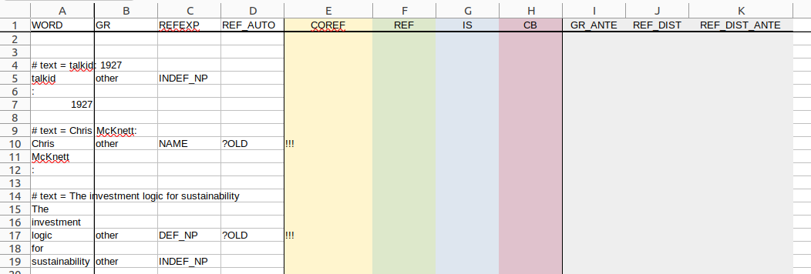

# 2. File Format and Editing

For the annotation of coreference and informaton structure, we use a tabular format and off-the-shelf spreadsheet software for annotation.

## 2.1 File Format

Following conventions for a long-standing series of shared tasks organized in conjunction with the Conference on Natural Language Learning (CoNLL) since the late 1990s, we adopt the following conventions:

- **one word per line**: One line describes one word and its annotations
- **tab-separated values**: A line consists of a fixed number of columns, separated by `<TAB>` (tabulator key)
- **empty line between sentences**: Two sentences are separated by an empty line.
- **use `#` for comments**: line starting with `#` are ignored when processing the file. Use this to add whatever additional information you want to express that doesn't fit the format otherwise.
- **put the text before every sentence**: To facilitate reading, the comment line before the sentence should contain the full text of the sentence.

This is the format for "raw" files, as produced by automated preprocessing. It can be opened in any text editor. For editing, you need to load these files in the spreadsheet software of your choice (see instructions below). The final deliverable should be one Excel (`*.xlsx`) file for every raw file, and it should have the same name (except for file extension) as the original file.

## 2.2 Raw files

The **raw files** are produced by automated pre-annotation. As part of pre-annotation, we perform tokenization (splitting words and punctuation), the detection of referring expressions, and the prediction of `?OLD` (for candidate anaphors, "primary markables") and `?NEW` (for other candidate referring expressions, "secondary markables").

Note that as part of text extracting and automated pre-annotation, some errors can occur, e.g., incorrectly split words, or incorrect type of referring expressions. **Please, do NOT fix these errors.** Instead, add a comment starting with `#` before the sentence. In your spreadsheet software, you might need to insert a row first.

The raw files currently contain three columns:

- `WORD`: words and punctuation characters as they occur in the text.
- `GR`: grammatical role
- `NP_FORM`: type of referring expression (noun phrase) 
- `REF_AUTO`: predicted referentiality, i.e., `?OLD` or empty

## 2.3 XLSX files

Annotators do not directly operate with raw files, but with `*.xlsx` files. This is the native format of MS Excel, but should be processable with any other common spreadsheet software. These files include 

- all information from the raw files
- pre-formatting for columns which are subject to annotations
- formulas to pre-annotate some of these columns

An XLSX file may contain more than one worksheet. For word-level annotations, select the sheet named `word-level annotation`. Note that the worksheet is provided in **protected** mode. That means that only certain columns and certain fields can (and should) be changed by the annotator.

> **Note on import**: These files contain a significant number of formulas and formatting instructions. It is normal that the import is relatively slow. If your spreadsheet software reports timeout errors, ignore them. If the problem persists, contact your instructor.

> **Note on LibreOffice**: Import has been tested with LibreOffice and no failures have been reported. If you encounter difficulties with slow response times, save the file in the native LibreOffice format (`*.odt`) and use that instead of the original XLSX file.

> **Note on protected mode**: In protected mode, columns and rows cannot be resized. If this is necessary, annotators are free to turn off protection. Please do not re-enable protection afterwards so that we can spot those files.

The worksheet for word-level annotations contains the following columns:

- `WORD`: words and punctuation characters as they occur in the text. In protected mode, this cannot be changed.
- `GR`: grammatical role. Annotators should leave this intact unless a parser error is observed.
- `NP_FORM`: type of referring expression (noun phrase). Annotators can correct this column.
- `REF_AUTO`: predicted referentiality, i.e., `?OLD` or empty. Annotators should not correct this column. 
- `COREF`: manual coreference annotation or `!!!` for an annotation to be done. **TO BE ANNOTATED**
- `REF`: manual annotation for referentiality, automatically pre-annotated after `COREF` annotation. **TO BE ANNOTATED**
- `IS`: manual annotation for information status ("givenness"), automatically pre-annotated after `COREF` annotation. **TO BE ANNOTATED**
- `CB`: manual annotation for backward-looking center ("topic"), automatically pre-annotated after `COREF` annotation. **TO BE ANNOTATED**
- the following three columns contain auxiliary annotations that are *hidden* (i.e., invisible to the annotator), these are not to be annotated, but part of the automated pre-annotation process
	- `GR_ANTE`: grammatical role of the antecedent (factor in `IS` and `CB` annotation)
	- `REF_DIST`: referential distance of the antecedent (factor in `IS` and `CB` annotation)
	- `REF_DIST_ANTE`: referential distance annotation of the antecedent (factor in `IS` annotation)

- `COMMENT`: this is a free-text column for annotators to provide information about the annotation (e.g., ambiguity), free-text comments, or pointers to more lengthy descriptions. Lengthy comments increase row height, so annotators may want to adjust column width.

Open your new file `xyz.xlsx` in your preferred spreadsheet software. You can use any tool you like, but it **must** support reading and writing MS Excel 365 files (`*.xlsx`) and they **should** support Excel formulas. Possible tools include MS Office tools, LibreOffice/OpenOffice, Google Spreadsheet (in Google Docs), etc. If you have difficulties using or getting these tools, please get in touch with your instructor.

For illustration, we use OpenOffice in Fig. 1. Other spreadsheet software should be similar.

| Fig. 1. Sample file                            |
| ---------------------------------------------- |
|  |

## 2.4 Annotation Procedure

- Annotation with spreadsheet software has a different feeling to it than just reading a text. It is highly recommended that you also look at the original plain text file, at least for a first read, before you start with with the spreadsheet annotation. 
- When doing annotation, ignore headlines. For doing so, just delete the content of the `NP_FORM` and `REF_AUTO` columns for lines you identified as headlines or other pieces of metadata ("boilerplate"). For `ted-mdb.1927`, for example, this includes the following "sentences":

	- "talkid: 1927"
	- "Chris McKnett"
	- "The investment logic for sustainability"

	> Note that this applies only to content you identify clearly as headline or boilerplate. If you are uncertain as to if a line is a headline or not, treat it as part of the text.   

- Annotate from top to bottom, just as you read. You can use the `REF_AUTO` column for quickly jumping to the next primary markable with `<CTRL>+<DOWN>`. You can go back to the last with `<CTRL>+<UP>`.
- Alternatively, you can also go to the next referring expressing with the `NP_FORM` column.

### 2.4.1 `COREF`: Coreference

- The first requirement of the task is to assign every primary markable (`?OLD`) an ID in the `COREF` column. Every discourse referent should correspond to exactly one ID, and all co-referring expressions receive the same ID.
- If a secondary markable (annotated for `NP_FORM`, but not for `REF_AUTO`) serves as antecedent for an anaphor with `COREF` ID *x*, give it the same `COREF` ID.

	> - You might want to try out for yourself if it is more convenient to either annotate all referring expressions with `COREF` or to only annotate `?OLD` expressions and then extend this to their antecedents when needed. Please drop a note on your experiences in the annotation protocol.

- For event anaphors (e.g., if `this` or `it` refers back to a preceding clause), candidate antecedents have not been marked in the `NP_FORM` column. For annotating them as antecedents, select the *main verb* of the highest (in case of conjunction, first) clause you consider as antecedent. Annotate it with the same `COREF` ID as used for the anaphor.
	
	> - Normally, the main verb expresses the semantic predicate of a clause or sentence, e.g., "The world is [changing] ...".
	> - In copula clauses, annotate the copula as antecedent, e.g., "These [are] environmental and social issues".
	> - Do not annotate `NP_FORM` for the antecedent of an event anaphor.
	> - If you have difficulties to decide which antecedent to annotate for an event anaphor, select the closest and smallest candidate, i.e., an embedded clause in favor of a main clause, the directly preceding sentence in favor of the one before, etc.

- If you encounter a non-referring `?OLD` expression, delete its `REF_AUTO` annotation (i.e., `?OLD`), but tell us which kind of non-referring expression it is using `REF`, etc.
- Use the `COMMENT` column to keep track of ambiguities or free-text comments.

### 2.4.2 `REF`: Referentiality

After annotating `COREF` for a referring expression, the `REF` column should contain the pre-annotation `OLD` or `NEW`. See the [section on coreference](coreference.md) for the meaning of these terms and other possible values. 

- Please verify or revise the pre-annotation. If it is not altered, we consider it to be approved.
- If you had to delete an `?OLD` pre-annotation for the current line, please annotate `REF` manually.
- Use the `COMMENT` column for comments on your annotation, e.g., to document problems.

### 2.4.3 `IS`: Information Status

After `COREF` and `REF` annotation, you will see pre-annotations for the `IS` column. These implement a *simplified and **incomplete** subset* of the constraints in the [corresponding section](information-status.md) that is to be manually confirmed or revised.

- Please verify or revise the pre-annotation. If it is not altered, we consider it to be approved.
- Note that the manual requires to check the applicability of annotations in a particular order. Please follow that approach here. Do **not** start with confirming the automatically pre-annotated information status, but follow the order of statuses in the manual.

### 2.4.4 `CB`: Backward-Looking Center

After `COREF` annotation, you will see pre-annotations for the `IS` column. These implement a *simplified and **incomplete** subset* of the constraints in the [corresponding section](information-status.md) that is to be manually confirmed or revised.

- Please verify or revise the pre-annotation. If it is not altered, we consider it to be approved.
- Make sure that there is at most one `CB` per sentence and that all automated annotations with question marks (indicating possible `CB` candidates) are removed.
- By automated annotation, all referring expressions with antecedents in the last sentence are marked as `CB` candidates (with question marks). Make sure to remove incorrect candidates as part of your annotation.

### 2.4.5 `COMMENT` and Annotation Protocol

The `COMMENT` column can contain free text comments or specialized tags (e.g., for ambiguity). If you want to add more than one comment, separate them by a pipe (`|`).

In addition, please create an annotation protocol as an independent document to be shared along with your file. For the target file "xyz.xslx", that should be named "xyz.log" or "xyz.log.txt". Open and edit with a text editor.

Note that this view is not suited for longer text, so, longer comments should be put into the annotation protocol, but *linked* with the annotation. For doing that linking, create the comment `NOTE(`*abbreviation*`)` in the `COMMENT` column, using an *abbreviation* of your choice (must be unique, though, you could just use numbers). In the annotation protocol, you can then create a separate paragraph starting with "NOTE(abbreviation):" and put detailed comments there.

In addition to that, you can (and should) use the annotation protocol to keep track of any observations you made during the annotation process, e.g., difficulties in interpreting or applying the annotation manual. This will guide future revision efforts.

The annotation protocol should be saved in the same folder as the target file, and (except for the file extension), it should carry the same name.

## 2.5 On Evaluation

As we rely to some extent on automated pre-annotation, we need to quantify the number of average revisions of pre-annotated values per file and annotator.